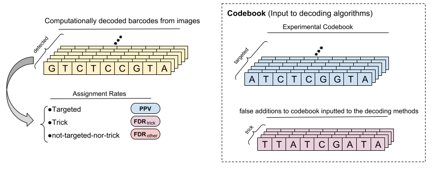

# Pseudo-Labeling Enhanced by Privileged Information and its application to In Situ Sequencing Images

 - [Link to Paper](will be added once published)
 - [Link to supplementary materials](https://github.com/carpenter-singh-lab/2023_Haghighi_IJCAI/blob/main/documentation/Haghighi_PLePI_ISS_IJCAI23_Supplementary_Materials.pdf)
 
 
 ## Table of Contents

- [Benchmark In-situ sequencing resource](#toc-dataset)
  - [Image dataset](#toc-imgs)
  - [Validation resource (NGS)](#toc-ngs-resource)
  - [Evaluation Metrics](#toc-eval-metrics)

  
- [Results](#toc-results)
  - [Table 1](#toc-t1)
    - TODO - link cleaned repo specific to this experiment 
  - [Table 2](#toc-t2)
    - Ablation experiments to check the effect of annotation quality and incorporation of privileged information
  - [Table 3](#toc-t3)
    - Benchmarking experiments and baseline comparison

## A. Benchmark In-situ sequencing resource
###  A.1. Image dataset

We created a benchmark dataset of cells treated with a library of genetic reagents tagged with 186 barcodes of nine digits each. We provide two plate of cells consists of two rows and three columns of wells. Each well contains about 500000 single cells and 20 million four-channel spots in ISS images of nine cycles. Not all cells have spots, and some cells have more than one spot. Each well is imaged at 316 sites (locations) within the well; we used our in-house pipelines to correct for general microscopic illumination patterns on each image and align the images across cycles in order to correct for small differences in physical plate position on the microscope for each cycle’s imaging. The images are subsequently stitched, scaled, and recropped into 100 larger "pseudo-site" images. Each pseudo-site’s image dimensions are (x:5500, y:5500, channels:4, cycles:9). 

This preprocessed dataset available at cell-painting-gallery s3 bucket as a bench-marking resource for developing computational barcode calling methods using ISS images.
- [Link to the data in Gallery](x)

### A.2. Validation resource for cell-level barcode abundance in a pool of single cells.
As there is no direct ground truth for the barcodes assigned to each image location, we evaluate the barcode calling performance in an indirect way. By applying Next-Generation-Sequencing (NGS) on the pooled screens we can quantify the expressed integrated barcodes. We applied NGS to a separate sample of the same cell population that was placed into the 6 wells of our plate, enabling us to count the number of cells perturbed by each barcode. Abundance of transcripts for these genomically integrated barcodes were captured by kallisto tool. Abundance of barcodes based on any decoding strategy applied on this dataset can be calculated as a post-processing step. We can then compare barcode calling strategies to the NGS abundance measures as the experiments’ ``perturbation abundance ground-truth".
The NGS data is at the bulk level, i.e. a pool of cells are all sequenced together. Because each barcode integrates into the cell’s DNA once and only once, and most cells receive only a single integration due to our experimental setup, the NGS information approximates the abundance of cells with a specific transcript or barcode. By contrast, the image-based barcode calling methods read out mRNA spots which can be present in variable copy numbers per cell rather than genomic DNA (which is present in only one copy per cell). For this reason, we cannot expect the number of NGS reads of barcoded cells to linearly correlate with the number of image-based reads of barcoded mRNA transcripts; to assess correlation of our results with NGS data we therefore first need to assign barcode spots to cells to produce cell-level barcode assignments. 
As explained in Section 4.5 of the paper, for the methods which provide a confidence metric on detected barcodes, we assign each cell with the most confident barcode within that cell. For the methods with no confidence scores on the detected barcodes, we assign the barcode with the largest number of occurrence to each cell. And in the case of multiple barcodes with equal occurrence rate, we simply skip the cell assignment.
- [NGS data](https://github.com/carpenter-singh-lab/2023_Haghighi_IJCAI/blob/main/resource/CP228_NGS_Reads_And_Library_Mapped.csv)

### A.3. Evaluation Metrics.
We aim to achieve the highest possible number of cells with a correct barcode assignment. Therefore, the main evaluation metrics are rate of cell recovery and the matches between abundance of cell assignments and the NGS-based barcode abundance:

- ### Cell Recovery Rate. 
  - Recovery rate is defined as the ratio of cell assignments with a targeted barcode over the total number of detected cells by CellProfiler. Note that there are a number of cells that dont recieve any barcode assignments and therefore this number is different than the PPV at the cell level.

- ### NGS match. 
As described in Section A.2, NGS-based relative abundance of each barcode in the experiment serves as an indirect ground truth to assess the quality of the relative abundance of the detected barcodes assigned to the cells which also exist in the experimental codebook. The similarity between the abundance of the detected cell-level barcode assignments and the NGS-based abundance of codebook barcodes is measured by $R^2$ between the two abundance distributions.

- ### False Discovery Analysis. 
The next set of metrics are for false discovery analysis and are calculated at both spot-level and cell-level barcode assignments. Following figure illustrates the distinction among the various possible types of barcode assignments. The codebook inputted to the decoding algorithms contains two sets of barcodes:
- **Targeted** barcodes which form the experimental codebook or the experiments reference library of barcodes.
- **Trick** barcodes are a collection of intentionally fabricated barcodes that, although not part of the original experimental codebook, are added to the codebook inputted to the decoding algorithms. These barcodes, once introduced into the decoding algorithms, serve as an insightful tool for false discovery analysis, aiding in the identification and assessment of potential overfitting issues inherent in the decoding process.

A decoding method can generally assign spots to any sequence of base letters and therefore there exists a third category of "not-targeted-nor-trick" which include the rest of assignmnets that are not targeted nor trick barcodes.

- $FDR$: Incorrect assignment rates for two categories of "trick" and "not-targeted-nor-trick" calls are reported as False Discovery Rates (FDR) and are denoted as $FDR_{trick}$ and $FDR_{other}$ respectively.
- $PPV$: Correct assignment rate refers to the rate of the targeted assignments which is $1-FDR$. We report this metric as the Positive Predictive Value ($PPV$) at each spot and cell-level barcode assignments as well.

    

## Results
### Table.1
- TO BE ADDED
### Table.2 Ablation experiments

| Strategy | LQ   NGS Match   ($R^2$) | LQ   Cell Recovery   (Rate) | HQ   NGS Match   ($R^2$) | HQ   Cell Recovery   (Rate) |
| --- | --- | --- | --- | --- |
| - | 0.81 | 0.54 | 0.86 | 0.62 |
| PLePI-ISS | 0.9 | 0.63 | 0.93 | 0.66 |
| PLe**PI**-ISS | 0.92 | 0.66 | 0.94 | 0.71 |

### Table.3 Comparison to Baseline SOTA ISS Decoders
- We have adopted the public source code for each Starfish, Postcode, ISTDECO and BarDensr for their application into our dataset. The adopted scripts can be found in the baseline generation repository:
   - [Baseline Methods Application Repo](https://github.com/broadinstitute/Barcode_Benchmark_Periscope)

- Script X can be used For generating the PLePI-ISS results in this table.

| Method       | NGS match   ($R^2$) | cell recovery   (Rate) | $PPV$       (cell/spot)    | $FDR_{trick}$   (cell/spot)| $FDR_{other}$   (cell/spot)|
|--------------|-----------|---------------|--------------|---------------|---------------|
| ISTDECO      | 0.73      | 0.45          | 0.994 / 0.992| 0.006 / 0.0077| 0 / 0         |
| PoSTcode     | 0.89      | 0.71          | 0.92 / 0.93  | 0 / 0.0001    | 0.0799 / 0.0695|
| Starfish     | 0.92      | 0.72          | 0.912 / 0.872| 0 / 0         | 0.0883 / 0.1278|
| BarDensr     | 0.95      | 0.71          | 0.997 / 0.99 | 0.003 / 0.0103| 0 / 0         |
| **PLePI-ISS** | 0.94      | 0.72          | 0.918 / 0.908| 0 / 0         | 0.0819 / 0.0918|

 

